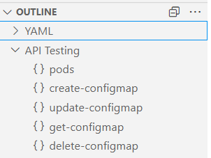

[API Testing](https://github.com/linuxsuren/api-testing) for Visual Studio Code

All issues of this project can be found at [linuxsuren/api-testing](https://github.com/LinuxSuRen/api-testing/issues).

## Prerequisities
Start [atest](https://github.com/linuxsuren/api-testing) in server mode before get started.

You could run it in Docker or Kubernetes, please see also the following example:

```shell
docker run -d -p 7070:7070 ghcr.io/linuxsuren/api-testing
```

or you could run atest as Linux service:
```
atest service --action install
```

## Usage
Please see the [sample](https://github.com/LinuxSuRen/api-testing/tree/master/sample) if you're not familiar with it.

For mulitple environments use case, you could put a special file `env.yaml` in your desired directory:

```yaml
- name: localhost # environment name
  env:
    SERVER: http://localhost:7070 # environment variables
```

## Screenshots


